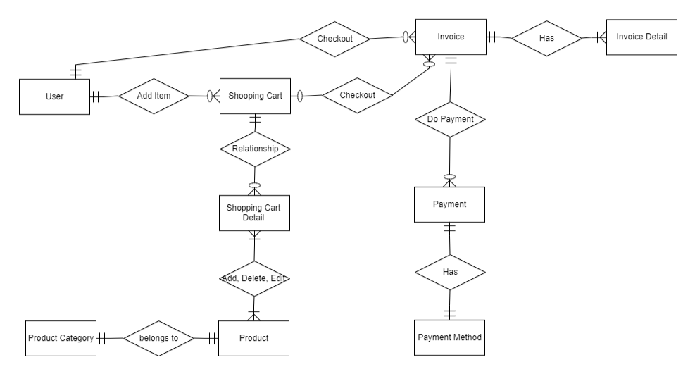

# Shopping App

Shopping App - Shopping API developed with golang std lib.

## Entity Relationshop Diagram


## Installation

There are 2 ways to run the app :

# Clone the repo
```bash
$ git clone https://github.com/funukonta/shopping
$ cd shopping/cmd/
$ docker run --name shopping -e POSTGRES_PASSWORD=shopping -p 5432:5432 -d postgres && sleep 2 && docker exec -it shopping psql -U postgres -d postgres -c "CREATE DATABASE shoppingdb;"
$ go run .
```

or using docker compose

```bash
$ git clone https://github.com/funukonta/shopping
$ cd shopping/
$ docker compose up -d
```

# Test the endpoints
There's postman exported file, you can import to your own postman and test the enpoints.